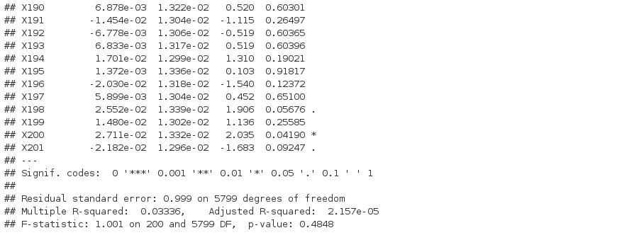

# Part one

### Question a)

```{r}

set.seed(0)

# creation of the vector
v = rnorm(6000*201, mean=0, sd=1)

# creation of the matrix 6000 lines and 201 columns
mat = matrix(data = v, nrow = 6000, ncol = 201)

# turn the matrix into a data frame
dataFrame = data.frame(mat)
dataFrame

# creation of the linear model
reg = lm(formula = X1 ~ . , data = dataFrame)

# uncomment that following part to see the summary of the regression
# summary(reg)

```

### Question b)

We assume that $y$ and $\forall i$, $\mu_i$ is a vector of size $6000$.

\begin{bmatrix}
y & \mu_1 & \mu_2 & \cdots & \mu_{200} \\
\end{bmatrix}

The associated equation is :

$y = \displaystyle \sum_{k=1}^{200} \beta_k \mu_k + \epsilon$

We expect that all $\beta_k$ are equals to $0$ because there is no correlation between vectors. We expect that $\epsilon$ is the only thing different than $0$, so $\epsilon$ is equal to $y$.



### Question c)

```{r}

# stock in the vector coef all the p-values
coef <- summary(reg)$coefficients[, 4]

# here we select the p-values assessed as significantly non-zero at level 5%
coef[coef < 0.05]

# count the number of those selected coefficients
length(coef[coef < 0.05])

```

This result is not expected at all since we computed random independant variables from the classic Gaussian model $\mathcal{N}(0, 1)$. All the $\beta_k$ should be equals to zero, however this is not the case because as there is many data, the linear model find some correlation between vectors that do not really exists.

# Part two

### Question a)

```{r}

set.seed(3)

# creation of three vectors
eps_1 <- rnorm(1000)
eps_2 <- rnorm(1000)
eps_3 <- rnorm(1000)

# creation of the model
X_1 = eps_1
X_2 = 3*X_1 + eps_2
Y = 2 + X_1 + X_2 + eps_3

# plot the cloud of points (X_1,X_2)
plot(X_1, X_2)


# creation of three new vectors
eps_1 <- rnorm(10)
eps_2 <- rnorm(10)
eps_3 <- rnorm(10)

# creation of the new model
X_1 = eps_1
X_2 = 3*X_1 + eps_2
Y = 2 + X_1 + X_2 + eps_3

mat_reg1 <- matrix(data = c(Y, X_1), nrow = 10, ncol = 2)
mat_reg2 <- matrix(data = c(Y, X_2), nrow = 10, ncol = 2)
mat_reg3 <- matrix(data = c(Y, X_1, X_2), nrow = 10, ncol =3)

# turn the matrix into a data frame
dataFrame1 = data.frame(mat_reg1)
dataFrame2 = data.frame(mat_reg2)
dataFrame3 = data.frame(mat_reg3)

# creation of the linear model
reg1 = lm(formula = X1 ~ . , data = dataFrame1)
reg2 = lm(formula = X1 ~ . , data = dataFrame2)
reg3 = lm(formula = X1 ~ . , data = dataFrame3)

summary(reg1)
summary(reg2)
summary(reg3)
```

The points are approximatively aligned, we obtain almost a positive linear straight line because there is a linear equation between $X_1$ and $X_2$.


### Question c)

```{r}


```


