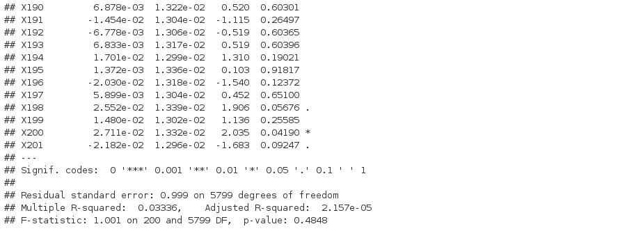

Lamyaa BOUZBIBA
Eloise JULIEN
Alexandre POUPEAU

# Part one

### Question a)

```{r}

set.seed(0)

# creation of the vector
v = rnorm(6000*201, mean=0, sd=1)

# creation of the matrix 6000 lines and 201 columns
mat = matrix(data = v, nrow = 6000, ncol = 201)

# turn the matrix into a data frame
dataFrame = data.frame(mat)

# creation of the linear model
reg = lm(formula = X1 ~ . , data = dataFrame)

# uncomment that following part to see the summary of the regression
# summary(reg)

```

### Question b)

We assume that $y$ and $\forall i$, $\mu_i$ is a vector of size $6000$.

\begin{bmatrix}
y & \mu_1 & \mu_2 & \cdots & \mu_{200} \\
\end{bmatrix}

The associated equation is :

$y = \beta_0 + \displaystyle \sum_{k=1}^{200} \beta_k \mu_k + \epsilon$

We expect that all $\beta_k$ are equals to $0$ because there is no correlation between vectors. We expect that $\epsilon$ is the only thing different than $0$, so $\epsilon$ is equal to $y$.

Here is an extract from the summary of the regression. Computed by "summary(reg)". We only took the last part of it just to show that most of the p-value are not small, as expected, however some are not (they get like one star). The explanation of those one star (or plus) coefficients is present just after.



### Question c)

```{r}

# stock in the vector coef all the p-values
coef <- summary(reg)$coefficients[, 4]

# here we select the p-values assessed as significantly non-zero at level 5%
coef[coef < 0.05]

# count the number of those selected coefficients
length(coef[coef < 0.05])

```

This result is not expected at all since we computed random independant variables from the classic Gaussian model $\mathcal{N}(0, 1)$. All the $\beta_k$ should be equals to zero, however this is not the case because as there is many data, the linear model find some correlation between vectors that do not really exists. This is a problem because it happens in real study in compagny and we have to be aware of that effect in order to not misunderstand the result.

# Part two

### Question a)

```{r}

set.seed(3)

# creation of three vectors
eps_1 <- rnorm(1000)
eps_2 <- rnorm(1000)
eps_3 <- rnorm(1000)

# creation of the model
X_1 = eps_1
X_2 = 3*X_1 + eps_2
Y = 2 + X_1 + X_2 + eps_3

# plot the cloud of points (X_1,X_2)
plot(X_1, X_2, main = "Cloud of point between X_1 and X_2")

```

The points are approximatively aligned, we obtain almost a positive linear straight line because there is a linear equation between $X_1$ and $X_2$. This is due to the linear fonction that link $X_1$ and $X_2$.

### Question b)

```{r}

# creation of three new vectors
eps_1 <- rnorm(10)
eps_2 <- rnorm(10)
eps_3 <- rnorm(10)

# creation of the new model
X_1 = eps_1
X_2 = 3*X_1 + eps_2
Y = 2 + X_1 + X_2 + eps_3

# create a matrix
mat_reg1 <- matrix(data = c(Y, X_1), nrow = 10, ncol = 2)

# turn the matrix into a data frame
dataFrame1 = data.frame(mat_reg1)


# creation of the linear model
reg1 = lm(formula = X1 ~ . , data = dataFrame1)

# summary with every p-value and coefficients analysis
summary(reg1)

```

The first one shows the correlation between $Y$ and $X_1$ (written as $X2$ in the summary). We can clearly see that there is a link between those variables since the p-value of $X2$ and the p-value of the F-test are both small (approximately $10^-5$).

```{r}

# create a matrix
mat_reg2 <- matrix(data = c(Y, X_2), nrow = 10, ncol = 2)

# turn the matrix into a data frame
dataFrame2 = data.frame(mat_reg2)

# creation of the linear model
reg2 = lm(formula = X1 ~ . , data = dataFrame2)

# summary with every p-value and coefficients analysis
summary(reg2)
```

The second one shows the correlation between $Y$ and $X_2$ (written as $X2$ in the summary). We can notice that there is also a link between those two variables for the same reasons exposed just before. Plus, we can notice that both p-value in that case are smaller (approximately $10^-7$). Therefore, we can deduce that $Y$ might have a bigger correlation with $X_2$ than $X_1$.

### Question c)

```{r}

# create a matrix
mat_reg3 <- matrix(data = c(Y, X_1, X_2), nrow = 10, ncol =3)

# turn the matrix into a data frame
dataFrame3 = data.frame(mat_reg3)

# creation of the linear model
reg3 = lm(formula = X1 ~ . , data = dataFrame3)

# summary with every p-value and coefficients analysis
summary(reg3)

```

Finally, when we analyze the summary of the regression of $Y$ with $X_1$ (written as $X2$ in the summary) and $X_2$ (written as $X3$ in the summary), we can see that $X_1$ doesn't have a that small p-value. We were expected that both, $X_1$ and $X_2$, would have a small p-value, however only $X_2$ has. So what that this means ? One first explanation is that both $X_1$ and $X_2$ are useful to describe the model nevertheless $X_2$ contains the entire information contained in $X_2$ with a bit more. When we take a look at the model, this is exactly this : $X_2 = 3*X_1 + \epsilon_2$.
plot(density(Y), main = "Density Y")
To explain that situation, we can talk about confounding factors. This can be explained because both $X_1$ and $X_2$ can be described with only $X_1$.

Those points of views are quiet consistent since we have the real model used to generate $Y$. So we can directly understand where the results come from. If there is a error we can analyze what's the main difference with the $Y$ model.


### Question d)

Definition in this type of model used for the next question :

$\hat{\beta_1} = \mathcal{N(\beta_1, \sigma^2/(n*s^2))}$

```{r}

# for us
#plot(density(Y), main = "Density Y")

#plot(density(X_1), main = "Density X_1")

#plot(density(X_2), main = "Density X_2")

# for the question
beta1 <- reg3$coefficients[1]
beta2 <- reg3$coefficients[2]
n <- 10

x1 <- seq(beta1-0.5, beta1+0.5, 0.01)
norm1 <- dnorm(x1, mean = beta1, sd = 1/(n*var(X_1)))
plot(x1, norm1, main = "Density of Beta1", type = "l")
abline(v = quantile(norm1, 0.025))
abline(v = quantile(norm1, 0.975))

x2 <- seq(beta2-0.5, beta2+0.5, 0.01)
norm2 <- dnorm(x2, mean = beta2, sd = 1/(n*var(X_2)))
plot(x2, norm2, main = "Density of Beta2", type = "l")
abline(v = quantile(norm2, 0.025))
abline(v = quantile(norm2, 0.975))

```

We can notice that, as we expect in the precedent question, $X_2$ has a bigger link with $Y$ than $X_1$ since we have less imprecision on $\beta_2$ and we have more information on its value.


